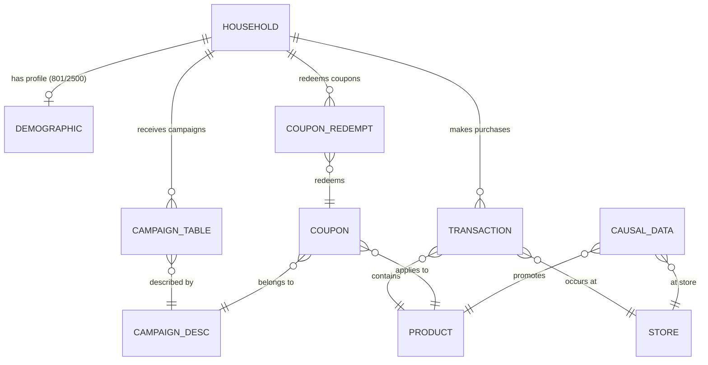

# 🛒 Customer Lifetime Value Prediction — Dunnhumby

[](https://www.python.org/)
[](LICENSE)
[](https://github.com/psf/black)

> **Production-grade CLV prediction pipeline** for forecasting Customer Lifetime Value in the Retail/FMCG industry using the Dunnhumby "The Complete Journey" dataset.

**Course**: Data Driven Marketing | **Team**: DSEB65A — Group 6

---

## 📋 Table of Contents

- [Project Overview](#-project-overview)
- [Data Architecture](#-data-architecture)
- [Pipeline Stages](#-pipeline-stages)
- [Project Structure](#-project-structure)
- [Getting Started](#-getting-started)
- [Configuration](#-configuration)
- [Testing](#-testing)
- [License](#-license)

---

## 🎯 Project Overview

### Business Context

Customer Lifetime Value (CLV) is one of the most critical metrics in modern retail marketing. It quantifies the **total net revenue a company can expect from a customer over their entire relationship**. Accurate CLV prediction enables:

- **Customer Segmentation**: Identify high-value vs. at-risk customers
- **Marketing Budget Allocation**: Invest more in acquiring/retaining high-CLV segments
- **Personalized Campaigns**: Tailor promotions based on predicted future value
- **Churn Prevention**: Proactively engage customers whose predicted CLV is declining

### Academic Context

This project is developed for the **Data Driven Marketing** course, demonstrating how data science techniques (RFM analysis, probabilistic models, machine learning) can solve real-world marketing optimization problems.

### Dataset

We use the **Dunnhumby — The Complete Journey** dataset, which contains:
- **2,500 households** tracked over **102 weeks** (~2 years)
- **2.5 million+ transactions** across multiple retail stores
- Demographic profiles, marketing campaigns, coupon activities, and product metadata

### Methodology

| Approach | Model | Description |
|----------|-------|-------------|
| **Probabilistic** | BG/NBD + Gamma-Gamma | Classic CLV framework — models purchase frequency and monetary value separately |
| **Supervised ML** | XGBoost / LightGBM | Feature-engineered approach using RFM + demographics as predictors |

---

## 🗄️ Data Architecture

### Dataset Overview

The Dunnhumby dataset consists of **8 relational tables** capturing the complete shopping journey:

#### 1. `transaction_data.csv` (141 MB, ~2.5M rows)
Core transaction-level data recording every purchase.

| Column | Type | Description |
|--------|------|-------------|
| `household_key` | int | Unique identifier for each household (primary entity for CLV) |
| `BASKET_ID` | int | Unique identifier for each shopping trip/basket |
| `DAY` | int | Day number relative to the start of the study (1–711) |
| `PRODUCT_ID` | int | Unique identifier for the purchased product |
| `QUANTITY` | int | Number of units purchased for this product |
| `SALES_VALUE` | float | Dollar amount paid by the customer after all discounts applied at POS |
| `STORE_ID` | int | Identifier for the store where the transaction occurred |
| `RETAIL_DISC` | float | Discount applied due to retailer's loyalty/store program (stored as **negative** value) |
| `TRANS_TIME` | int | Time of transaction in HHMM format (e.g., 1631 = 4:31 PM) |
| `WEEK_NO` | int | Week number of the transaction (1–102) |
| `COUPON_DISC` | float | Discount applied via manufacturer coupon (stored as **negative** value) |
| `COUPON_MATCH_DISC` | float | Additional discount when a coupon matches a retailer promotion (stored as **negative** value) |

#### 2. `hh_demographic.csv` (44 KB, 801 rows)
Demographic profile of a **subset** of households (801 out of 2,500).

| Column | Type | Description |
|--------|------|-------------|
| `household_key` | int | Household identifier (joins to transaction_data) |
| `AGE_DESC` | str | Age range of the primary shopper (e.g., "19-24", "25-34", "35-44", "45-54", "55-64", "65+") |
| `MARITAL_STATUS_CODE` | str | Marital status: "A" (married) or "B" (single) |
| `INCOME_DESC` | str | Annual household income range (e.g., "Under 15K", "15-24K", ..., "250K+") |
| `HOMEOWNER_DESC` | str | Home ownership status: "Homeowner", "Renter", "Probable Homeowner", "Probable Renter", "Unknown" |
| `HH_COMP_DESC` | str | Household composition (e.g., "1 Adult Kids", "2 Adults No Kids", "Single Male") |
| `HOUSEHOLD_SIZE_DESC` | str | Number of people in the household ("1", "2", "3", "4", "5+") |
| `KID_CATEGORY_DESC` | str | Presence of children: "None/Unknown", "1", "2", "3+" |

#### 3. `campaign_table.csv` (96 KB)
Records which households received which marketing campaigns.

| Column | Type | Description |
|--------|------|-------------|
| `DESCRIPTION` | str | Campaign type ("TypeA", "TypeB", "TypeC") |
| `household_key` | int | Household that received the campaign |
| `CAMPAIGN` | int | Campaign identifier (joins to campaign_desc) |

#### 4. `campaign_desc.csv` (540 B)
Metadata describing each marketing campaign's type and duration.

| Column | Type | Description |
|--------|------|-------------|
| `DESCRIPTION` | str | Campaign type classification |
| `CAMPAIGN` | int | Unique campaign identifier |
| `START_DAY` | int | Day number when campaign begins |
| `END_DAY` | int | Day number when campaign ends |

#### 5. `coupon.csv` (2.8 MB)
Maps coupons to products and campaigns — which products were discountable via which coupons.

| Column | Type | Description |
|--------|------|-------------|
| `COUPON_UPC` | int | Universal Product Code for the coupon itself |
| `PRODUCT_ID` | int | Product this coupon applies to (joins to product & transaction_data) |
| `CAMPAIGN` | int | Campaign this coupon belongs to (joins to campaign_desc) |

#### 6. `coupon_redempt.csv` (54 KB)
Records actual coupon redemption events by households.

| Column | Type | Description |
|--------|------|-------------|
| `household_key` | int | Household that redeemed the coupon |
| `DAY` | int | Day number when redemption occurred |
| `COUPON_UPC` | int | Coupon that was redeemed (joins to coupon) |
| `CAMPAIGN` | int | Campaign the redeemed coupon belongs to |

#### 7. `product.csv` (6.4 MB)
Product master data with hierarchical category information.

| Column | Type | Description |
|--------|------|-------------|
| `PRODUCT_ID` | int | Unique product identifier (joins to transaction_data, coupon) |
| `MANUFACTURER` | int | Manufacturer code |
| `DEPARTMENT` | str | Top-level product department (e.g., "GROCERY", "DRUG GM") |
| `BRAND` | str | Brand type: "National" (branded) or "Private" (store brand) |
| `COMMODITY_DESC` | str | Product category description (e.g., "SOFT DRINKS", "FLUID MILK PRODUCTS") |
| `SUB_COMMODITY_DESC` | str | Detailed sub-category (e.g., "REGULAR COLA", "SS WHOLE MILK") |
| `CURR_SIZE_OF_PRODUCT` | str | Package size (e.g., "2 LT", "12 OZ", "1 GAL") |

#### 8. `causal_data.csv` (695 MB)
Store-level promotional display and mailer information for products each week.

| Column | Type | Description |
|--------|------|-------------|
| `PRODUCT_ID` | int | Product identifier |
| `STORE_ID` | int | Store identifier |
| `WEEK_NO` | int | Week number |
| `display` | str | In-store display location code (e.g., "0" = none, "A" = aisle endcap) |
| `mailer` | str | Mailer/flyer inclusion code (e.g., "0" = none, "A" = front page) |

### Entity Relationships



> **Key Insight**: `household_key` is the **central entity** for CLV analysis. All aggregations must be performed at this level — NOT at individual transaction or product level.

---

## 🔄 Pipeline Stages

### Stage 1: Data Exploration (EDA)
- Load and profile all 8 Dunnhumby tables
- Report schemas, missing values, distributions
- Generate visualizations → `reports/figures/`

### Stage 2: Temporal Splitting
- Split `transaction_data` into **Calibration** (Weeks 1–75) and **Holdout** (Weeks 76–102) periods
- Time-based split ensures no data leakage — **no random splitting**

### Stage 3: RFM Aggregation
- Aggregate transactions at `household_key` level:
  - **R**ecency: weeks since last purchase
  - **F**requency: number of distinct shopping trips
  - **M**onetary: `Gross_Sales` (SALES_VALUE) and `Net_Sales` (after all discounts)
- Also computes: tenure, avg basket size, store diversity, coupon response features

### Stage 4: Feature Engineering
- Merge RFM with demographics (801/2500 coverage)
- Handle missing demographics: `has_demographics` flag + KNN/Mode imputation
- Encode categorical demographic features

### Stage 5: Modeling (Future)
- **Probabilistic**: BG/NBD (frequency) + Gamma-Gamma (monetary) via `lifetimes`
- **Supervised ML**: XGBoost / LightGBM with engineered features

### Stage 6: Evaluation (Future)
- Compare predicted vs. actual CLV in holdout period
- Metrics: MAE, RMSE, calibration plots

---

## 📂 Project Structure

```
data_driven_marketing_project/
│
├── configs/                          # Configuration files
│   └── config.yaml                   # All pipeline parameters (YAML)
│
├── data/                             # Data storage (gitignored)
│   ├── raw/                          # Original Dunnhumby CSVs (immutable)
│   ├── interim/                      # Intermediate outputs (RFM tables)
│   └── processed/                    # Final datasets for modeling
│
├── logs/                             # Pipeline execution logs
│
├── models/                           # Serialized model artifacts
│
├── notebooks/                        # Jupyter notebooks for exploration
│
├── reports/                          # Generated analysis reports
│   └── figures/                      # Saved EDA plots and charts
│
├── src/                              # Production source code
│   ├── __init__.py
│   ├── data/
│   │   ├── __init__.py
│   │   └── data_loader.py            # DunnhumbyDataLoader (OOP)
│   ├── features/
│   │   ├── __init__.py
│   │   ├── rfm_builder.py            # RFMBuilder — RFM aggregation engine
│   │   ├── demographic_handler.py    # DemographicHandler — missing data
│   │   └── time_splitter.py          # TimeSplitter — temporal split
│   ├── models/
│   │   ├── __init__.py
│   │   └── (future: clv_models.py)
│   ├── visualization/
│   │   ├── __init__.py
│   │   └── eda_plots.py              # EDA visualization functions
│   └── pipeline/
│       ├── __init__.py
│       └── run_preprocessing.py      # Main orchestration script
│
├── tests/                            # Unit and integration tests
│
├── .gitignore
├── LICENSE
├── README.md
├── requirements.txt
└── setup.py
```

---

## 🚀 Getting Started

### Prerequisites

- Python 3.9+
- pip

### Installation

```bash
# Clone the repository
git clone https://github.com/DSEB65A-Group6/data_driven_marketing_project.git
cd data_driven_marketing_project

# Create and activate virtual environment
python -m venv .venv
.venv\Scripts\activate              # Windows
# source .venv/bin/activate         # macOS/Linux

# Install dependencies
pip install -r requirements.txt

# Install project in editable mode (enables `from src import ...`)
pip install -e .
```

### Data Setup

Download the **Dunnhumby — The Complete Journey** dataset and place all CSV files into `data/raw/`:

```
data/raw/
├── transaction_data.csv
├── hh_demographic.csv
├── campaign_table.csv
├── campaign_desc.csv
├── coupon.csv
├── coupon_redempt.csv
├── product.csv
└── causal_data.csv
```

### Quick Start

```bash
# Run the full preprocessing pipeline
python -m src.pipeline.run_preprocessing configs/config.yaml
```

This will:
1. Load and explore all datasets (schema report to console)
2. Split transactions into Calibration / Holdout periods
3. Build RFM tables aggregated by `household_key`
4. Merge and impute demographic features
5. Generate EDA visualizations → `reports/figures/`
6. Save processed datasets → `data/processed/`

---

## ⚙️ Configuration

All parameters are centralized in `configs/config.yaml`:

- **Data paths**: Locations of all raw CSV files
- **Temporal split**: Calibration cutoff week (default: 75)
- **RFM settings**: Aggregation parameters
- **Demographics**: Missing data handling strategy (KNN, Mode, flag-only)
- **Model configs**: BG/NBD, Gamma-Gamma, XGBoost hyperparameters
- **Output paths**: Where to save models, reports, and figures

---

## 🧪 Testing

```bash
# Run all tests
pytest tests/ -v

# Run with coverage
pytest tests/ --cov=src --cov-report=html
```

---

## 📄 License

Distributed under the MIT License. See `LICENSE` for more information.
