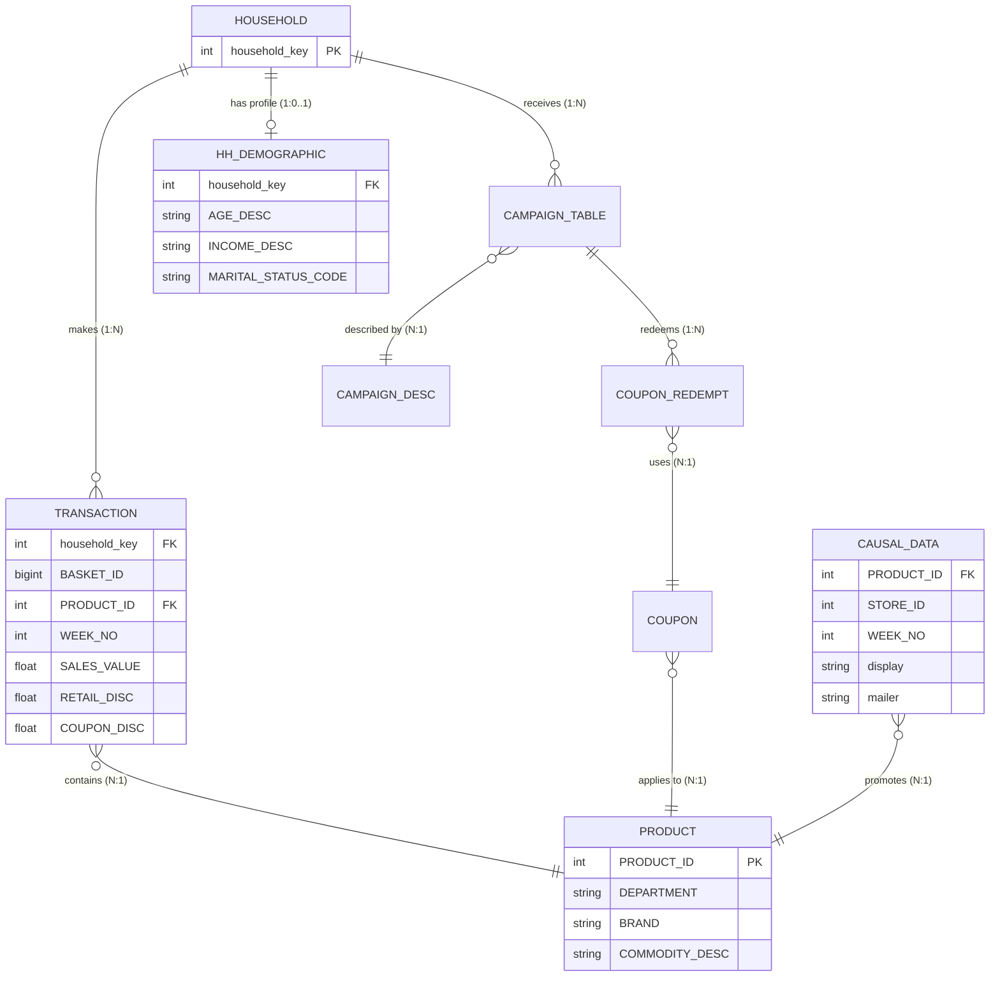
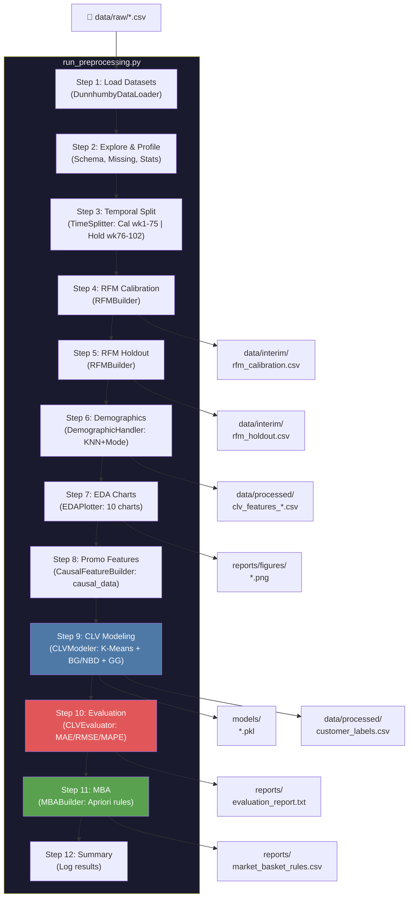

# 🏗️ Repository Architecture — CLV Prediction (Dunnhumby)

**Dự án**: Customer Lifetime Value Prediction  
**Team**: DSEB65A — Group 6  
**Ngày cập nhật**: 2026-05-04  

---

## 1. Cây thư mục tổng quan

```
data_driven_marketing_project/
│
├── configs/                           # ⚙️ Cấu hình pipeline
│   └── config.yaml                    #    Tập trung mọi tham số (paths, split, model hyperparams)
│
├── data/                              # 📦 Dữ liệu (gitignored)
│   ├── raw/                           #    Dữ liệu gốc Dunnhumby (không được sửa)
│   │   ├── transaction_data.csv       #    2.5M dòng giao dịch (141 MB)
│   │   ├── hh_demographic.csv         #    Thông tin nhân khẩu 801 hộ gia đình (44 KB)
│   │   ├── product.csv               #    Catalog sản phẩm (6.4 MB)
│   │   ├── causal_data.csv           #    Dữ liệu khuyến mãi store×week×product (695 MB)
│   │   ├── campaign_table.csv         #    Mapping hộ gia đình → chiến dịch (95 KB)
│   │   ├── campaign_desc.csv          #    Mô tả chiến dịch marketing (540 B)
│   │   ├── coupon.csv                 #    Thông tin coupon × sản phẩm (2.8 MB)
│   │   └── coupon_redempt.csv         #    Lịch sử sử dụng coupon (54 KB)
│   ├── interim/                       #    Dữ liệu trung gian (RFM tables)
│   │   ├── rfm_calibration.csv        #    RFM features kỳ Calibration (weeks 1-75)
│   │   └── rfm_holdout.csv            #    RFM features kỳ Holdout (weeks 76-102)
│   └── processed/                     #    Dữ liệu cuối cùng cho modeling
│       ├── clv_features_calibration.csv  # RFM + Demographics + Promo features (Cal)
│       ├── clv_features_holdout.csv      # RFM + Demographics (Holdout)
│       ├── customer_labels.csv           # Cluster ID + Segment name per household
│       └── rfm_clv_final.csv             # CLV predictions + segments
│
├── logs/                              # 📋 Log files
│   └── pipeline.log                   #    Log đầy đủ từ loguru (auto-rotation 10MB)
│
├── models/                            # 🧠 Serialized models (joblib)
│   ├── kmeans_model.pkl               #    K-Means + StandardScaler
│   ├── bgnbd_model.pkl                #    BG/NBD probabilistic model
│   ├── gg_model.pkl                   #    Gamma-Gamma monetary model
│   └── xgboost_model.pkl             #    (optional) XGBoost regressor
│
├── notebooks/                         # 📓 Jupyter Notebooks (Exploration)
│   ├── eda_notebook.ipynb             #    EDA đầy đủ: phân phối, cohort, MBA (có outputs)
│   └── rfm_clv_model.ipynb            #    Notebook modeling (stub, cần hoàn thiện)
│
├── reports/                           # 📊 Báo cáo & kết quả
│   ├── figures/                       #    Biểu đồ EDA (10 charts PNG)
│   │   ├── weekly_transactions.png
│   │   ├── sales_distribution.png
│   │   ├── rfm_distributions.png
│   │   ├── calibration_plot.png       #    Predicted vs Actual CLV scatter
│   │   └── ...
│   ├── market_basket_rules.csv        #    Association rules (Apriori output)
│   └── evaluation_report.txt          #    MAE, RMSE, MAPE metrics
│
├── scripts/                           # 📜 Scripts phụ
│   └── legacy/                        #    Scripts cũ (deprecated, giữ reference)
│       ├── data_prep.py               #    ETL standalone cũ (thay bằng pipeline chính)
│       └── modelling.py               #    Modeling script cũ (thay bằng clv_models.py)
│
├── src/                               # 🔧 Source Code chính
│   ├── __init__.py
│   ├── data/                          #    Module loading dữ liệu
│   │   ├── __init__.py
│   │   └── data_loader.py             #    DunnhumbyDataLoader (OOP, dtype optimization)
│   ├── features/                      #    Module feature engineering
│   │   ├── __init__.py
│   │   ├── rfm_builder.py             #    RFMBuilder (R-F-M aggregation, entity resolution)
│   │   ├── demographic_handler.py     #    DemographicHandler (KNN + mode imputation)
│   │   ├── time_splitter.py           #    TimeSplitter (temporal train/test split)
│   │   ├── mba_builder.py             #    MBABuilder (Apriori market basket analysis)
│   │   └── causal_features.py         #    CausalFeatureBuilder (promo sensitivity features)
│   ├── models/                        #    Module modeling
│   │   ├── __init__.py
│   │   ├── clv_models.py              #    CLVModeler (K-Means, BG/NBD, GG, XGBoost)
│   │   └── evaluator.py               #    CLVEvaluator (MAE, RMSE, MAPE, calibration plot)
│   ├── visualization/                 #    Module trực quan hóa
│   │   ├── __init__.py
│   │   └── eda_plots.py               #    EDAPlotter (10 biểu đồ chuẩn, dark theme)
│   └── pipeline/                      #    Pipeline orchestrator
│       ├── __init__.py
│       └── run_preprocessing.py        #    Entry point — 12-step end-to-end pipeline
│
├── tests/                             # 🧪 Unit tests (pytest)
│   ├── __init__.py
│   ├── test_data_loader.py            #    5 tests: init, load, dtypes, explore
│   ├── test_rfm_builder.py            #    7 tests: entity resolution, RFM columns, edge cases
│   ├── test_time_splitter.py          #    6 tests: temporal integrity, no overlap, no data loss
│   └── test_clv_models.py             #    6 tests: segmentation, labels, BG/NBD, persistence
│
├── .gitignore                         #    Ignore data/, models/, logs/, __pycache__
├── LICENSE                            #    Apache 2.0
├── README.md                          #    Tài liệu dự án (355 dòng, ERD, hướng dẫn)
├── requirements.txt                   #    Dependencies (numpy, pandas, sklearn, lifetimes, etc.)
└── setup.py                           #    Editable install: pip install -e .
```

---

## 2. Chi tiết từng Module

### 2.1 `src/data/data_loader.py` — DunnhumbyDataLoader

| Method | Chức năng |
|--------|-----------|
| `__init__(config)` | Khởi tạo, validate paths từ config.yaml |
| `load_transactions()` | Load 2.5M dòng giao dịch với dtype downcasting (int64→int32, float64→float32) |
| `load_demographics()` | Load thông tin nhân khẩu 801/2500 hộ |
| `load_products()` | Load catalog sản phẩm (DEPARTMENT, BRAND, COMMODITY) |
| `load_causal_data()` | Load 695MB causal data (hỗ trợ chunked reading) |
| `load_campaigns()` | Load mapping household → campaign |
| `load_campaign_desc()` | Load mô tả chiến dịch |
| `load_coupons()` | Load thông tin coupon |
| `load_coupon_redemptions()` | Load lịch sử dùng coupon |
| `explore(df, name)` | In ra schema report: shape, dtypes, missing, stats |
| `explore_all_tables()` | Explore tất cả 8 tables cùng lúc |

---

### 2.2 `src/features/rfm_builder.py` — RFMBuilder

**Constraints enforced:**
1. **Entity Resolution**: Mọi aggregation đều dùng `household_key`
2. **Monetary Calculation**: Tính cả Gross_Sales và Net_Sales
3. **Memory Optimization**: Aggregate trước, merge demographics sau

| Output Column | Ý nghĩa |
|---------------|---------|
| `Recency` | Số tuần từ lần mua cuối → analysis_end (thấp = tốt) |
| `Frequency` | Số lần mua lặp lại = total_baskets - 1 (BG/NBD convention) |
| `T` | Tuổi khách hàng tính theo tuần |
| `avg_monetary` | Giá trị trung bình mỗi giao dịch (cho Gamma-Gamma) |
| `Gross_Sales` | Tổng doanh thu trước discount |
| `Net_Sales` | Tổng doanh thu sau discount |
| `coupon_usage_rate` | Tỷ lệ giỏ hàng dùng coupon |
| `distinct_stores` | Số cửa hàng khác nhau đã ghé |

---

### 2.3 `src/features/demographic_handler.py` — DemographicHandler

**Chiến lược xử lý missing**: `flag_and_impute`
- Tạo cờ nhị phân `has_demographics` (0/1)
- KNN imputation (k=5) cho biến ordinal (AGE_DESC, INCOME_DESC, HOUSEHOLD_SIZE_DESC)
- Mode imputation cho biến categorical (MARITAL_STATUS_CODE, HOMEOWNER_DESC)

---

### 2.4 `src/features/time_splitter.py` — TimeSplitter

Chia transactions theo thời gian (KHÔNG random split):
- **Calibration**: Weeks 1–75 (~73% data) → Dùng để train
- **Holdout**: Weeks 76–102 (~27% data) → Dùng để đánh giá

---

### 2.5 `src/features/mba_builder.py` — MBABuilder

| Method | Chức năng |
|--------|-----------|
| `build_basket_matrix()` | Tạo ma trận nhị phân basket × DEPARTMENT |
| `run_apriori()` | Chạy Apriori tìm frequent itemsets |
| `generate_rules()` | Sinh association rules (support, confidence, lift) |
| `save_rules()` | Export ra `reports/market_basket_rules.csv` |

---

### 2.6 `src/features/causal_features.py` — CausalFeatureBuilder

Trích xuất features từ `causal_data.csv` (695MB) bằng chunked processing:
| Feature | Ý nghĩa |
|---------|---------|
| `pct_display` | % sản phẩm mua khi được trưng bày nổi bật tại cửa hàng |
| `pct_mailer` | % sản phẩm mua khi xuất hiện trong tờ rơi quảng cáo |
| `promo_sensitivity` | Chỉ số nhạy cảm khuyến mãi tổng hợp |

---

### 2.7 `src/models/clv_models.py` — CLVModeler

| Method | Chức năng |
|--------|-----------|
| `segment_customers()` | K-Means clustering trên [Recency, Frequency, avg_monetary] |
| `_assign_segment_labels()` | Map cluster ID → business labels (Champions, Loyal, At Risk...) |
| `fit_bgnbd()` | Fit BG/NBD → dự báo số lần mua 6 tháng tới |
| `fit_gamma_gamma()` | Fit Gamma-Gamma → dự báo giá trị mỗi giao dịch → CLV |
| `fit_supervised()` | XGBoost/LightGBM dùng RFM + demographics + promo features |
| `save_models()` | Lưu tất cả models qua joblib (.pkl) |
| `run_all()` | Chạy toàn bộ pipeline modeling |

---

### 2.8 `src/models/evaluator.py` — CLVEvaluator

| Method | Chức năng |
|--------|-----------|
| `evaluate()` | Tính MAE, RMSE, MAPE so sánh predicted CLV vs actual holdout |
| `calibration_plot()` | Scatter plot predicted vs actual + đường 45° |
| `_save_report()` | Lưu metrics vào `reports/evaluation_report.txt` |

---

### 2.9 `src/visualization/eda_plots.py` — EDAPlotter

Tạo 10 biểu đồ chuẩn với dark theme và color palette nhất quán:
1. Weekly transaction volume
2. Sales value distribution
3. RFM distributions (3 histograms)
4. Demographic coverage
5. Top departments by revenue
6. Coupon usage patterns
7. Store visit frequency
8. Basket size distribution
9. Customer tenure distribution
10. Correlation heatmap

---

## 3. Entity Relationship Diagram — Dunnhumby



---

## 4. Pipeline Flow (12 Steps)



---

## 5. Hướng dẫn chạy End-to-End Pipeline

### 5.1 Cài đặt môi trường

```bash
# Clone repo
git clone https://github.com/DSEB65A-Group6/data_driven_marketing_project.git
cd data_driven_marketing_project

# Tạo virtual environment
python -m venv venv
venv\Scripts\activate          # Windows
# source venv/bin/activate     # macOS/Linux

# Cài dependencies
pip install -r requirements.txt

# Cài project ở chế độ editable (cho import src.*)
pip install -e .
```

### 5.2 Chuẩn bị dữ liệu

Đặt 8 file CSV của Dunnhumby vào thư mục `data/raw/`:
```
data/raw/
├── transaction_data.csv    (141 MB — bắt buộc)
├── hh_demographic.csv      (44 KB  — bắt buộc)
├── product.csv             (6.4 MB — bắt buộc)
├── causal_data.csv         (695 MB — bắt buộc cho promo features)
├── campaign_table.csv      (95 KB  — bắt buộc cho exploration)
├── campaign_desc.csv       (540 B  — bắt buộc cho exploration)
├── coupon.csv              (2.8 MB — bắt buộc cho exploration)
└── coupon_redempt.csv      (54 KB  — bắt buộc cho exploration)
```

### 5.3 Chạy pipeline

```bash
# Chạy toàn bộ pipeline (12 steps)
python -m src.pipeline.run_preprocessing configs/config.yaml
```

**Thời gian dự kiến**: 5-15 phút (tùy RAM và CPU), phần lớn thời gian dành cho `causal_data.csv` (Step 8) và K-Means (Step 9).

### 5.4 Chạy unit tests

```bash
# Chạy tất cả tests
python -m pytest tests/ -v

# Chạy với coverage report
python -m pytest tests/ -v --cov=src --cov-report=term-missing
```

### 5.5 Kiểm tra output

Sau khi pipeline chạy thành công, verify các file sau:

| File | Mô tả | Tạo bởi Step |
|------|--------|---------------|
| `data/interim/rfm_calibration.csv` | RFM features kỳ train | Step 4 |
| `data/interim/rfm_holdout.csv` | RFM features kỳ test | Step 5 |
| `data/processed/clv_features_calibration.csv` | Features đầy đủ (RFM + Demo + Promo) | Step 6, 8 |
| `data/processed/clv_features_holdout.csv` | Features holdout | Step 6 |
| `data/processed/customer_labels.csv` | Cluster + Segment labels | Step 9 |
| `data/processed/rfm_clv_final.csv` | CLV predictions tổng hợp | Step 9 |
| `models/kmeans_model.pkl` | K-Means + Scaler | Step 9 |
| `models/bgnbd_model.pkl` | BG/NBD model | Step 9 |
| `models/gg_model.pkl` | Gamma-Gamma model | Step 9 |
| `reports/evaluation_report.txt` | MAE, RMSE, MAPE | Step 10 |
| `reports/figures/calibration_plot.png` | Predicted vs Actual scatter | Step 10 |
| `reports/figures/*.png` | 10 EDA charts | Step 7 |
| `reports/market_basket_rules.csv` | Association rules | Step 11 |
| `logs/pipeline.log` | Full pipeline log | All steps |

### 5.6 Tùy chỉnh cấu hình

Mọi tham số đều nằm trong `configs/config.yaml`:

```yaml
# Thay đổi tỷ lệ split train/test
splitting:
  calibration_end_week: 75     # Tăng lên 80 để có ít holdout hơn

# Chuyển sang XGBoost thay vì BG/NBD
model:
  active: "xgboost"            # "bgnbd_gg" | "xgboost" | "lightgbm"

# Điều chỉnh hyperparameters
  xgboost:
    n_estimators: 500
    max_depth: 6
    learning_rate: 0.05
```

---

## 6. Tech Stack

| Category | Libraries |
|----------|-----------|
| **Core** | Python ≥ 3.9, NumPy, Pandas, SciPy |
| **ML** | scikit-learn, XGBoost, LightGBM, lifetimes |
| **MBA** | mlxtend (Apriori) |
| **Viz** | Matplotlib, Seaborn, Plotly |
| **Config** | PyYAML, python-dotenv |
| **Logging** | Loguru (file rotation, console colors) |
| **Testing** | pytest, pytest-cov |
| **Quality** | black, flake8, isort |
| **Persistence** | joblib |
